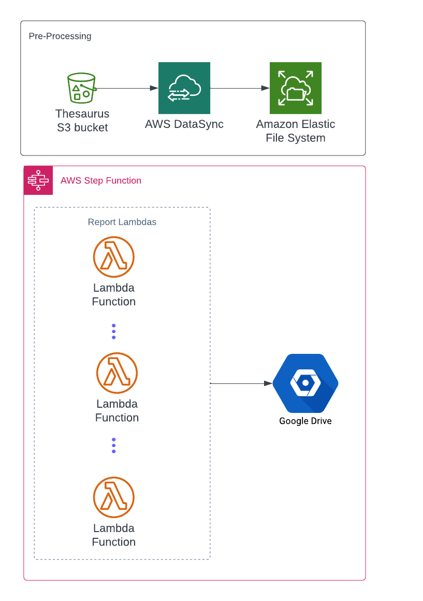
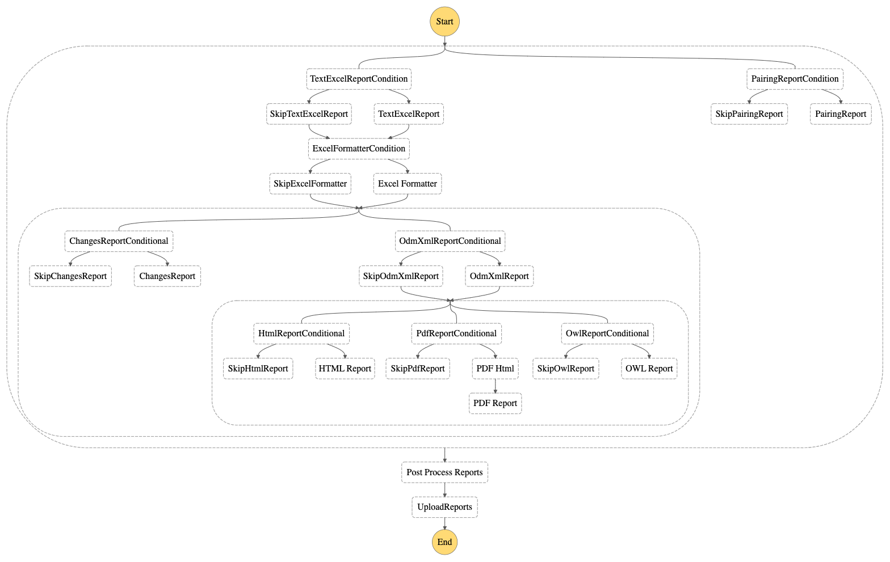

# ops-cdisc-reports
This project has a set of modules that create reports and artifacts from the NCI Thesaurus OWL file. 
It contains code that was moved from https://github.com/NCIEVS/ops-data-conversion and https://github.com/NCIEVS/nci-diff-CDISC. 
This project aims at consolidating those diseprate pieces and have a unified way to build, deploy and run the jobs to create the reports. 

Note that in this readme file, the term report is loosely defined and can be used to refer to TXT or XML files that are more like artifacts than reports. 
However in the interest of brevity we will refer to all files produced by these modules as reports.  

## Architecture
This projects makes use of Java 9 modules to separate and isolate the code producing individual reports. 
There is a common module that is used by all modules for shared code. All reports can be produced through command line. 
Each module that produces a report also has a Dockerfile. The main utility of the Dockerfile is easily deploy the code as an AWS Lambda function.

###AWS
The primary mode of running these reports is as a Step Function in AWS.
The following diagram shows the cloud infrastructure used to run these reports.



####File Transfer
The first step in the process is to transfer the Thesaurus file to Amazon Elastic File System (EFS). 
There is no direct way through the console to upload this file. 
If you have the file locally, it is possible to setup a DirectConnect and mount EFS as a network file system.
At the moment, the way to upload the file to EFS is to first upload to S3. Then use AWS Data Sync task to then transfer to EFS 
####Step Function
The following diagram shows the step function execution graph. 
It is basically a bunch of AWS functions that are executed in a specific order. 
There is an option to skip executing a particular report based on the input to the step function.
When all the reports are run, the reports are transferred to a Google Drive.

#####Sample input JSON
```json
{
  "thesaurusOwlFile": "/mnt/cdisc/Thesaurus-220613-22.06b.owl",
  "publicationDate": "06-14-2022",
  "conceptCodes": [
    "C81222",
    "C77527",
    "C67497",
    "C132298",
    "C120166",
    "C66830",
    "C77526",
    "C165634"
  ],
  "deliveryEmailAddresses":[<EMAIL_ADDRESSES>],
  "pairingReportRequest":{
  "thesaurusOwlFile": "/mnt/cdisc/Thesaurus-220613-22.06b.owl",
  "publicationDate": "2022-06-14",
  "conceptCodes": [
    "C81222",
    "C66830",
    "C77526"
  ]
  }
}
```
Description of fields in the input JSON
- thesaurusOwlFile: Absolute path to the Thesaurus file. Note this file is actually in EFS and is mounted to all the Lambda functions
- publicationDate: The date when the reports are published. The reports are run quarterly and published on a pre-determined date.
- conceptCodes: These are codes for which the reports are created. The Thesaurus file has lots of concepts in it. The reports are created for only a subset of those.
- deliveryEmailAddresses: The email addresses with whom the reports will be given access to in Google Drive.
- pairingReportRequest: The pairing reports use only a subset of conceptCodes. So it has a separate request object.
- Note: The default is to run all reports. To skip a report, specify skip<REPORT_NAME> in the root of the request. For example skipTextExcelReport

As mentioned before individual modules can be run as executable jar so these reports can be run standalone as well outside of AWS

##Code
Written in Java 11. We use lombok in this project. So any POJO that look strange and if you see compile errors.
Install lombok in your IDE
## Build
### Gradle
Gradle is used to build the project. Either individual modules can be build with

```shell
gradle changes-report:clean changes-report:build changes-report:assemble
```

Or the entire project with 

```shell
gradle clean build assemble
```

Some of the tests take a long time as they load the entire Thesaurus file into memory. 
So it is might be useful to skip the tests at times with the following -x test option

```shell
gradle clean build assemble -x test
```

At the moment we are not publishing any artifacts to Nexus. But we can if we need to in the future. 
An example exists in the text-excel-reports project. The publish task would be used to publish to Nexus.

### Terraform
We use Terraform to manage our AWS infrastructure. Terraform is run by the following command

```shell
terraform apply -var-file dev.tfvars
```

This should setup with everything that is needed in AWS to run these reports. 
Once the reports are run, use the following command to teardown the resources.

```shell
terraform apply -destroy -var-file dev.tfvars
```

Note, that the teardown is important to destroy EFS which is billed for storage. 
There are a couple of cloud resources like the S3 bucket that holds the Thesaurus file and the secrets to connect to Google Drive that are setup outside of terraform

##Tests
There are unit tests for each of the reports. These are run through gradle or in your IDE 